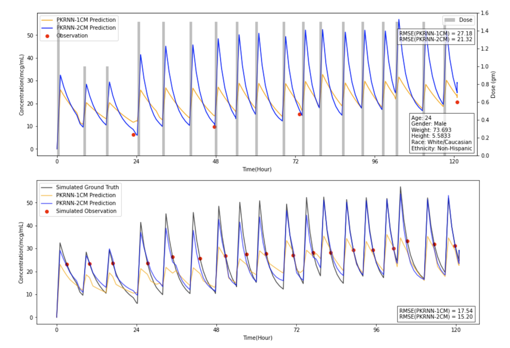

# PKRNN-2CM

This code repository provides the code to run the PKRNN-2CM, an autoregressive recurrent neural network (RNN) model containing a two-compartment (2CM) pharmacokinetic (PK) model as the prediction head for vancomycin dynamic prediction using time-series electronic health record (EHR) data.

## Overview

The PKRNN-2CM model integrates an RNN for PK parameter estimation and a 2CM PK model for generating concentration trajectory. This model has been developed using time series EHR data from a cohort of 5,483 patients.

  

Please refer to our preprint

>[**A deep-learning-based two-compartment predictive model (PKRNN-2CM) for vancomycin therapeutic drug monitoring**](https://www.medrxiv.org/content/10.1101/2024.01.30.24302025v1) Bingyu Mao, Ziqian Xie, Masayuki Nigo, Laila Rasmy, Degui Zhi

for more details.

## Steps to reproduce PKRNN-2CM

### Data

We won't provide the original dataset we used to develop the PKRNN-2CM model, but an example of the input data can be found here: [sample_data.pkl](https://github.com/ZhiGroup/PK-RNN/blob/main/sample_data.pkl). You may also refer to the [main branch](https://github.com/ZhiGroup/PK-RNN) for more details about the data format of the model input.

### Requirements

- Python 3.8;
- Required Python packages can be installed using `pip install -r requirements.txt`.

### Model training and evaluation

Please follow the steps in the notebook [main.ipynb](https://github.com/ZhiGroup/PK-RNN/blob/PKRNN-2CM/main.ipynb) to run the PKRNN-2CM model. This notebook also includes the steps for model evaluation.

## Results

 <be>

This figure shows the results of time-concentration curves for one sample patient. The top panel showcases a patient for whom the PKRNN-2CM model, when utilizing real data, outperformed the PKRNN-1CM model (PKRNN-1CM RMSE: 27.18; PKRNN-2CM RMSE: 21.32). In the bottom panel, the inference PKRNN-2CM model captured most of the simulated observations, whereas the inference PKRNN-1CM model missed over half of them, with consistent RMSEs (PKRNN-1CM: 17.54; PKRNN-2CM: 15.20). Please refer to our paper for more details.

## Contact

Please post a GitHub issue if you have any questions.

## Citation

Please acknowledge the following work in papers or derivative software:

Mao, B., Xie, Z., Nigo, M., Rasmy, L., & Zhi, D. (2024). A deep-learning-based two-compartment predictive model (PKRNN-2CM) for vancomycin therapeutic drug monitoring (p. 2024.01.30.24302025). medRxiv. https://doi.org/10.1101/2024.01.30.24302025
